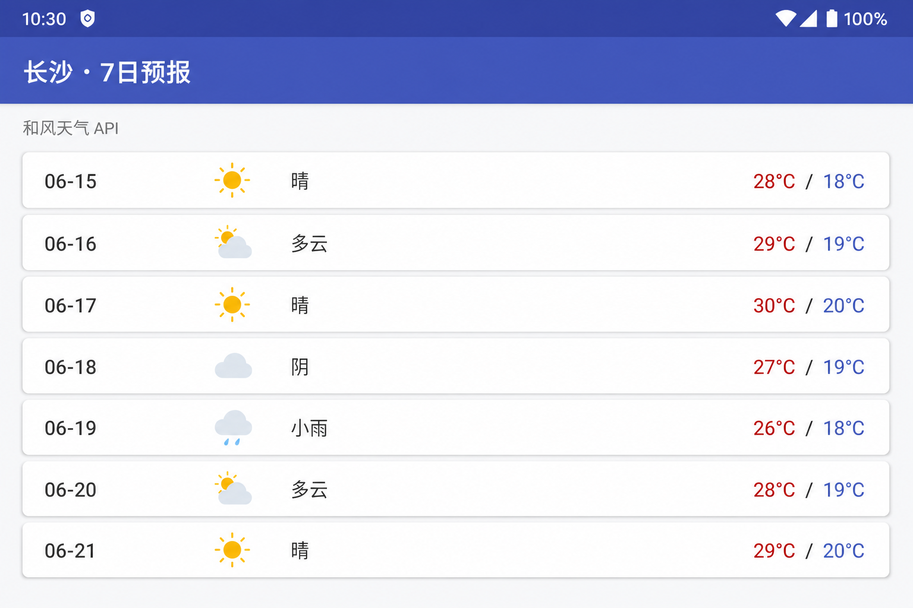
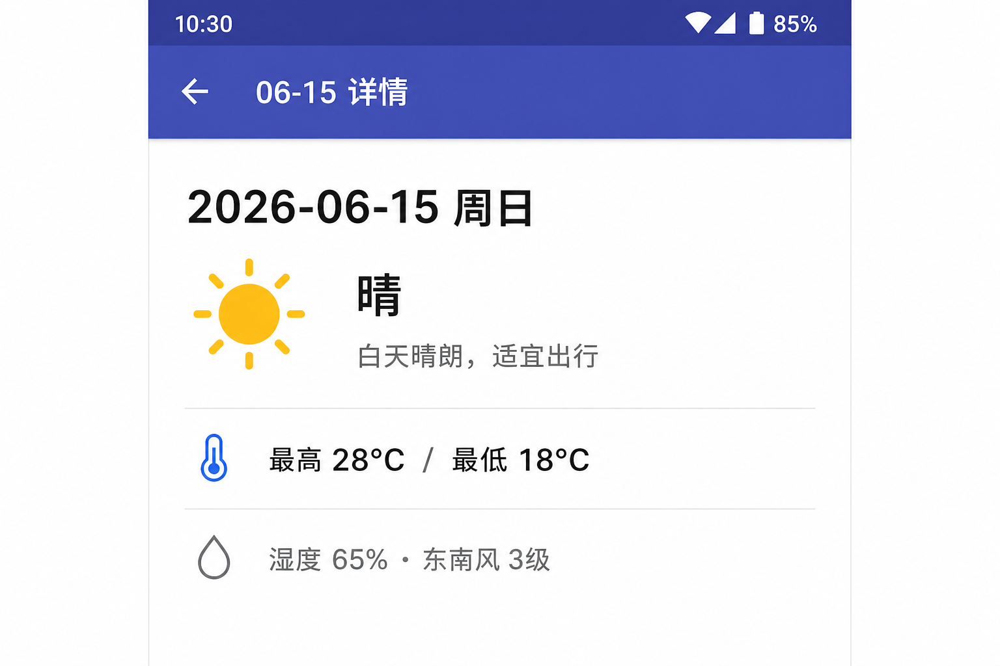
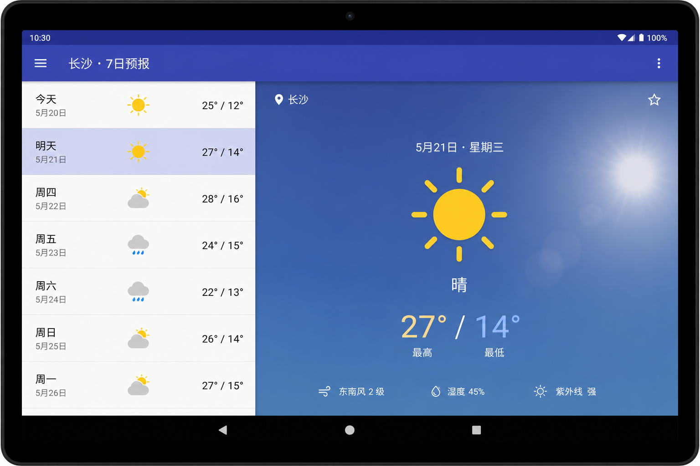
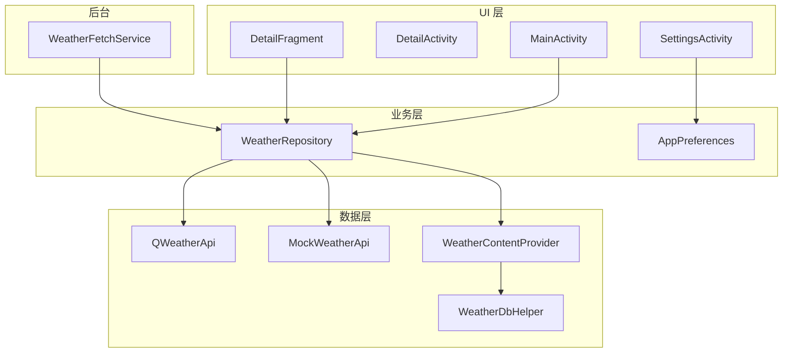

# WeatherForecast · Android 天气预报应用

[]()
[]()
[]()

中南大学《移动应用开发》课程项目 · 原生 Android 天气预报 App。覆盖 **四大组件**、**Repository 分层**、**SQLite 离线缓存**、**和风天气 JWT API** 与 **Master-Detail 自适应布局**。

## 应用截图

| 手机主界面 | 天气详情 | 平板 Master-Detail |
|:---:|:---:|:---:|
|  |  |  |

> 建议在真机/模拟器运行后，用 Android Studio **Logcat → Screenshot** 或 `adb exec-out screencap -p > screenshots/xxx.png` 替换为实际运行截图。

## 功能特性

| 模块 | 说明 |
|------|------|
| 7 日预报列表 | `MainActivity` + `RecyclerView` + `WeatherAdapter` |
| 详情页 | 手机 `DetailActivity`；平板右侧 `DetailFragment` 同屏展示 |
| Master-Detail | `layout-sw720dp` 双栏布局，按 `detail_container` 分支切换 |
| 设置 | 城市切换、摄氏/华氏、通知开关（`SharedPreferences`） |
| 地图 / 分享 | `geo:` Intent 跳转系统地图；`ACTION_SEND` 系统分享 |
| 后台通知 | `WeatherFetchService` 定时拉取并推送（演示间隔 60s） |
| 离线缓存 | `SQLite` + `ContentProvider`；无网读本地 |
| 网络数据源 | 和风天气 JWT（Ed25519）+ `MockWeatherApi` 降级 |

## 架构设计



### 数据流（有网 / 无网）

```
有网络 → QWeatherApi（失败则 Mock）→ 写入 SQLite → ContentProvider 查询 → UI 展示
无网络 → 直接读 SQLite 缓存 → UI 展示
```

### 目录结构

```
app/src/main/java/com/example/weatherforecast/
├── MainActivity.java              # 主列表、Master-Detail 分支
├── DetailActivity.java            # 手机详情容器
├── DetailFragment.java            # 详情 UI（手机/平板共用）
├── SettingsActivity.java          # 设置页
├── WeatherRepository.java         # 数据仓库（网络 + 缓存调度）
├── WeatherContentProvider.java    # ContentProvider 封装
├── WeatherDbHelper.java           # SQLite
├── QWeatherApi.java / QWeatherJwt.java
├── MockWeatherApi.java
├── WeatherFetchService.java       # 后台通知 Service
└── AppPreferences.java            # SharedPreferences
```

## 快速开始

### 环境要求

- Android Studio Hedgehog (2023.1+) 或更高
- JDK 17
- Android SDK（API 24–34）
- 模拟器或真机（API 24+）

### 运行步骤

1. **克隆仓库**

   ```bash
   git clone https://github.com/L-zidong/AndroidJWT.git
   cd AndroidJWT
   ```

2. **用 Android Studio 打开** 项目根目录，等待 Gradle Sync。

3. **配置 SDK**（首次）

   若缺少 `local.properties`，复制模板：

   ```bash
   cp local.properties.example local.properties
   ```

   编辑 `local.properties`，设置 `sdk.dir` 为本机 Android SDK 路径。

4. **运行**

   连接设备或启动模拟器 → 点击 **Run ▶**。

   未配置和风 API 时，App 自动使用 **Mock 数据**，不影响功能演示。

### 接入和风天气（可选）

1. 在 [和风控制台](https://console.qweather.com/) 创建项目，获取 **API Host**、**项目 ID**、**凭据 ID**。
2. 在 `local.properties` 中填写上述三项。
3. 将 Ed25519 **私钥** 放到 `app/src/main/assets/qweather_private.pem`（已在 `.gitignore` 中忽略，勿提交）。
4. **Build → Rebuild Project** 后运行。状态栏显示「和风天气 API」表示接入成功；失败则静默回退 Mock。

文档：[身份认证](https://dev.qweather.com/docs/configuration/authentication/) · [7 日预报 API](https://dev.qweather.com/docs/api/weather/weather-daily-forecast/)

### 测试离线模式

1. 联网运行一次，数据写入 SQLite。
2. 关闭 Wi-Fi 或开启飞行模式。
3. 再次打开 App，状态栏应显示「SQLite 本地缓存」。

## 技术栈

| 类别 | 技术 |
|------|------|
| 语言 | Java 17 |
| UI | AppCompat、Material Components、RecyclerView、Fragment |
| 存储 | SQLite、ContentProvider、SharedPreferences |
| 网络 | HttpURLConnection、JWT（Ed25519） |
| 构建 | Gradle、`BuildConfig` 编译期配置注入 |
| 适配 | Android 11+ `<queries>`、Android 13+ 通知运行时权限 |

## 常见问题

| 问题 | 解决方案 |
|------|---------|
| 路径含中文导致构建异常 | `gradle.properties` 已设 `android.overridePathCheck=true`；仍异常时请复制到纯英文路径 |
| 启动闪退 | 检查是否声明 `ACCESS_NETWORK_STATE` 权限 |
| 地图 / 分享无法跳转 | Android 11+ 需在 Manifest 中声明 `<queries>` |
| Android 13 无通知 | 在设置页保存时需授予 `POST_NOTIFICATIONS` |

## 许可证

本项目仅供学习与求职作品集展示，和风天气 API 使用须遵守其服务条款。

## 作者

刘子东 · 中南大学计算机科学与技术 · 2023 级
